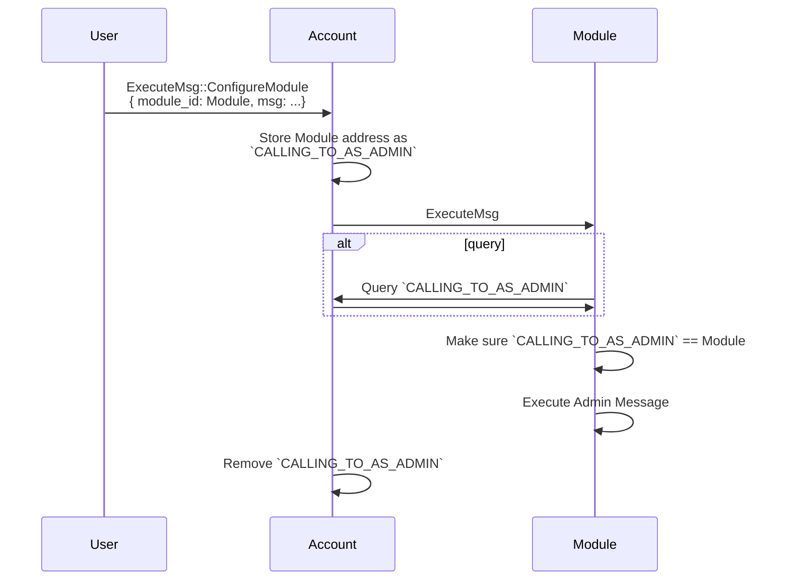
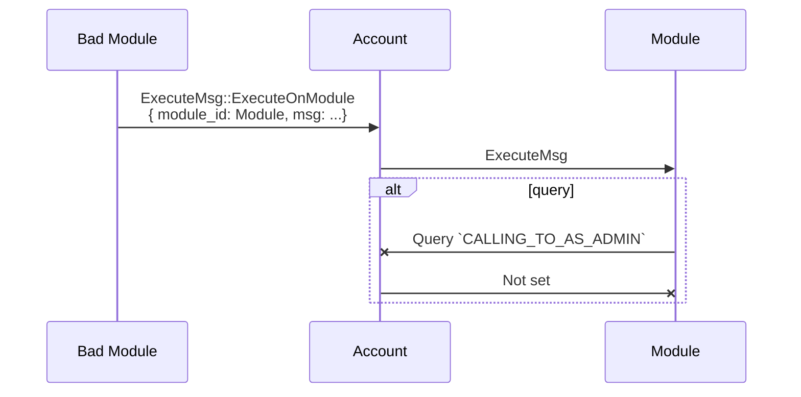
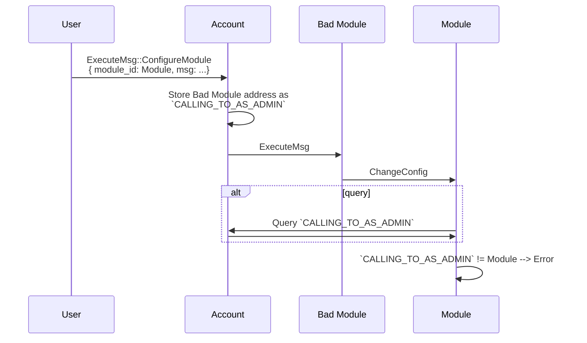

# Abstract Ownership

Abstract uses multiple ownership capabilities for different use cases.

## CW Ownable

Utility for controlling ownership of [CosmWasm](https://github.com/CosmWasm/cosmwasm) smart contracts.

### How to use

Initialize the owner during instantiation using the `initialize_owner` method provided by this crate:

```rust
use cosmwasm_std::{entry_point, DepsMut, Env, MessageInfo, Response, Empty};
use abstract_std::objects::ownership::OwnershipError;

#[entry_point]
pub fn instantiate(
    deps: DepsMut,
    env: Env,
    _info: MessageInfo,
    msg: InstantiateMsg,
) -> Result<Response<Empty>, OwnershipError> {
    cw_gov_ownable::initialize_owner(deps.storage, deps.api, msg.owner.as_deref())?;
    Ok(Response::new())
}
```

Insert a new variant, `UpdateOwnership` to the ExecuteMsg enum:

```rust
#[cw_serde]
enum ExecuteMsg {
    UpdateOwnership(cw_gov_ownable::Action),
    Foo {},
    Bar {},
}
```

Where `Action` can be one of three:

- Propose to transfer the contract's ownership to another account
- Accept the proposed ownership transfer
- Renounce the ownership, permanently setting the contract's owner to vacant

Handle the messages using the `update_ownership` function provided by this crate:

```rust
use cosmwasm_std::{entry_point, DepsMut, Env, MessageInfo, Response};
use abstract_std::objects::ownership::{update_ownership, OwnershipError};

#[entry_point]
pub fn execute(
    deps: DepsMut,
    env: Env,
    info: MessageInfo,
    msg: ExecuteMsg,
) -> Result<Response, OwnershipError> {
    match msg {
        ExecuteMsg::UpdateOwnership(action) => {
            update_ownership(deps, &env.block, &info.sender, action)?;
        }
        _ => unimplemneted!(),
    }
    Ok(Response::new())
}
```

Insert a new variant to the QueryMsg, `Ownership`:

```rust
#[cw_serde]
#[derive(QueryResponses)]
enum QueryMsg {
    #[returns(Ownership<String>)]
    Ownership {},
    #[returns(FooResponse)]
    Foo {},
    #[returns(BarResponse)]
    Bar {},
}
```

Handle the message using the `get_ownership` function provided by this module:

```rust
use cosmwasm_std::{entry_point, Deps, Env, Binary};
use abstract_std::objects::ownership::get_ownership;

#[entry_point]
pub fn query(deps: Deps, env: Env, msg: QueryMsg) -> StdResult<Binary> {
    match msg {
        QueryMsg::Ownership {} => to_binary(&get_ownership(deps.storage)?),
        _ => unimplemented!(),
    }
}
```

### Edge cases

## NFT governance type

For NFT-owned accounts the account's ownership is determined by **who owns the related NFT**. I.e. when transferring the ownership of the NFT all the accounts related to that NFT also change ownership.
In the case where the NFT contract does not return a valid `owner_of`, the account's ownership will be treated as if it was renounced and the account becomes unavailable. This would happen when an NFT is burned or something happens with NFT contract.

## Abstract Account Controlled Module

For modules and contracts controlled by Abstract Accounts, we present a mechanism that allows those contracts to make sure that an in-coming message from the Account was originally called by an admin and not another module. This prevents modules from calling admin functions on other modules and thus makes the module system more resistent to malicious modules.

### Mechanism

Modules and Account Owners can execute actions through the Account using the `account::ExecuteMsg::Execute` message variant. In order to execute an admin call, owners need to call `account::ExecuteMsg::AdminExecute`. The admin function will then:

- Set the `CALLING_TO_AS_ADMIN` storage item to the target address of the admin call.
- Call the specified function on the target module or contract.
- Remove the `CALLING_TO_AS_ADMIN` storage item.

In order to check that the call is an admin call, the target module or contract needs to check that the `CALLING_TO_AS_ADMIN` storage item is present on the account contract and that it contains `env.contract.address`. If it's not set or a different address, it should error, as the call is not an authorized admin call.

### Usage inside a module

To use this functionality, Abstract provides helpers in form of the `NestedAdmin` structure. This structure should be used to handle `Abstract Accounts` as admin of a contract.

The `NestedAdmin::assert_admin` function will only return an `Result::Ok` if any of those conditions is true:

- The caller is the saved Account AND the `CALLING_TO_AS_ADMIN` variable is set on the account to either:
  - The contract account address
  - The `CALLING_TO_AS_ADMIN_WILD_CARD`, that is used for contract migrations to avoid re-setting the flag during migration events.
- The caller is the top-level owner of the saved Account

So inside `Abstract Apps` for instance, one should write the following lines to shield admin actions:

```rust
app.admin.assert_admin(deps.as_ref(), &env, info.sender)?;
```

### Graphical sequences

#### Successful admin call



#### Error, not admin call



#### Malicious Module can’t execute Admin function of other Module


